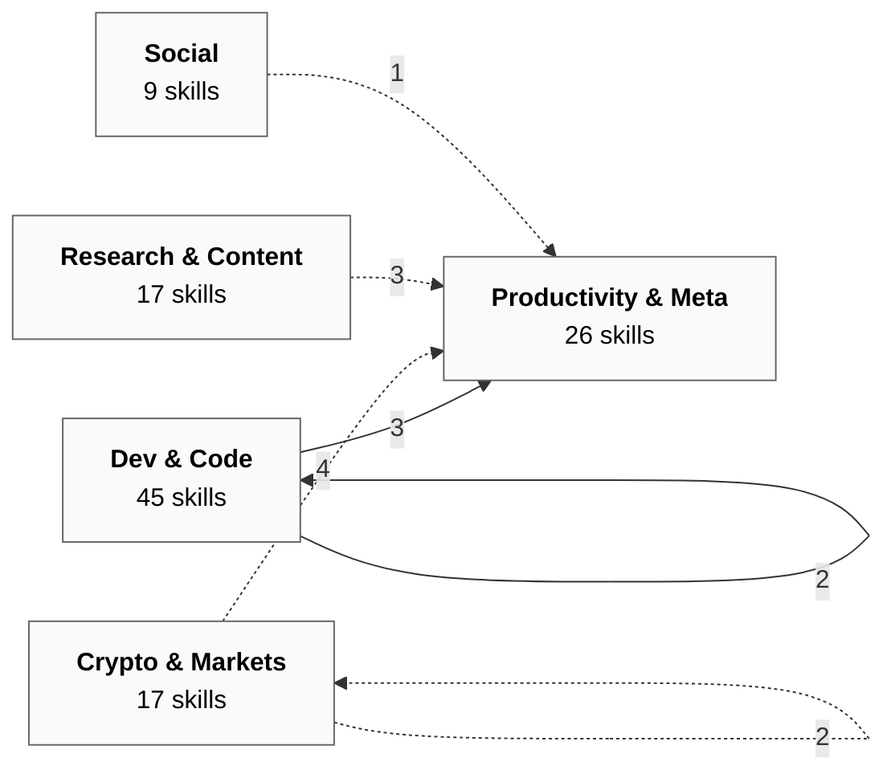
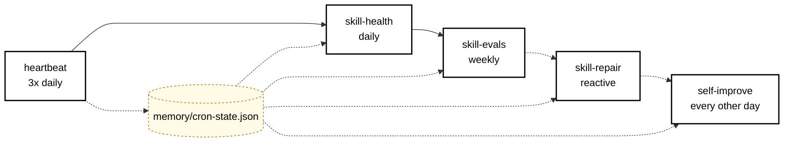
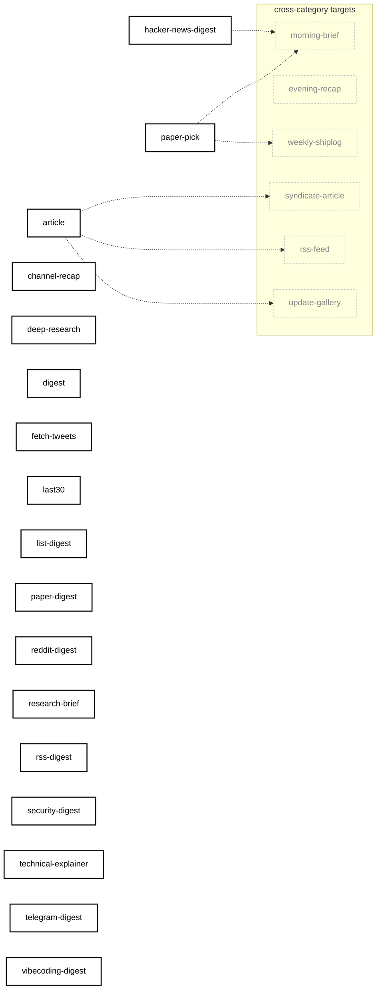
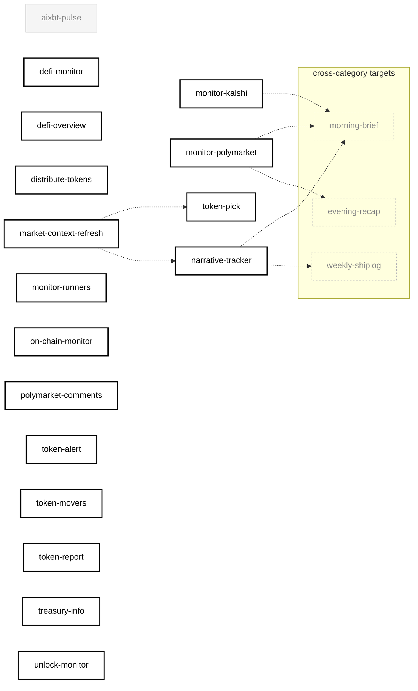
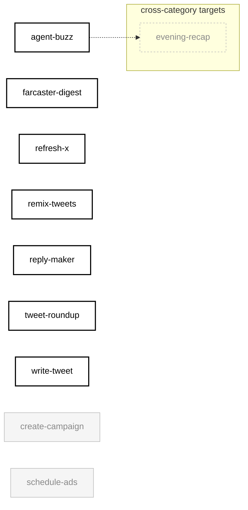
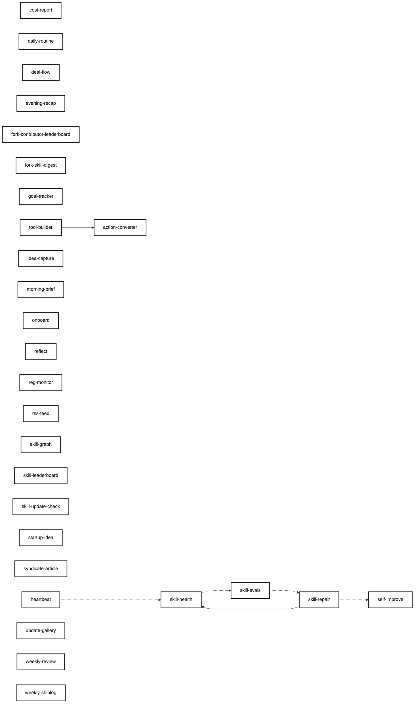

# Skill Dependency Graph

> Auto-generated by `skill-graph` on 2026-05-03. Mode: `SKILL_GRAPH_NEW`. Re-run the skill to update.

**Verdict:** `NEW_SKILLS: aixbt-pulse, create-campaign, firecrawl, firecrawl-agent, firecrawl-build-interact, firecrawl-build-onboarding, firecrawl-build-scrape, firecrawl-build-search, firecrawl-crawl, firecrawl-download, firecrawl-interact, firecrawl-map, firecrawl-parse, firecrawl-scrape, firecrawl-search, fork-contributor-leaderboard, fork-skill-digest, onboard, schedule-ads, security, skill-graph, syndicate-article` · 114 skills mapped, 96 enabled.

---

## Legend

| Edge | Meaning |
|------|---------|
| `-->` solid | `depends_on` — skill requires another to run first |
| `-.->` dashed | `consume` — chain step receives output from prior step |
| `-..->` dotted | reactive trigger or shared-state derived edge |

| Node style | Meaning |
|------------|---------|
| **bold border** | enabled in `aeon.yml` (cron-scheduled or workflow_dispatch) |
| faded grey | on disk but not enabled in `aeon.yml` (utility / on-demand only) |
| dashed border | external (cross-category dependency shown as ghost in mini-diagrams) |

> Note: every skill writes `memory/cron-state.json` after each run. The self-healing loop (`heartbeat → skill-health → skill-evals → skill-repair → self-improve`) consumes that state. Those 90+ shared-state edges are collapsed into the loop callout below rather than rendered as edges.

Click any node in any diagram to jump to its `SKILL.md`.

---

## Overview — categories + cross-category edges

Edges between categories are aggregated counts. The two intra-category arrows are inside `dev` (auto-merge / pr-review / vuln-scanner cluster) and `crypto` (market-context fan-out).

---

## Self-Healing Loop

The most important dependency cluster in Aeon. Five meta skills form a closed loop that detects, classifies, and patches problems.

`skill-repair` declares `depends_on: [skill-health]` (hard edge). The rest are shared-state edges via `cron-state.json`.

---

## Research & Content (17)

---

## Dev & Code (45)

15 firecrawl utility skills are present on disk but not enabled in `aeon.yml` — they're MCP/library helpers invoked by other skills, not cron-scheduled.

```mermaid
flowchart LR
    auto-merge[auto-merge]:::enabled
    auto-workflow[auto-workflow]:::enabled
    autoresearch[autoresearch]:::enabled
    changelog[changelog]:::enabled
    code-health[code-health]:::enabled
    create-skill[create-skill]:::enabled
    deploy-prototype[deploy-prototype]:::enabled
    external-feature[external-feature]:::enabled
    fleet-control[fleet-control]:::enabled
    fork-fleet[fork-fleet]:::enabled
    github-issues[github-issues]:::enabled
    github-monitor[github-monitor]:::enabled
    github-releases[github-releases]:::enabled
    github-trending[github-trending]:::enabled
    issue-triage[issue-triage]:::enabled
    pr-review[pr-review]:::enabled
    project-lens[project-lens]:::enabled
    push-recap[push-recap]:::enabled
    repo-actions[repo-actions]:::enabled
    repo-article[repo-article]:::enabled
    repo-pulse[repo-pulse]:::enabled
    repo-scanner[repo-scanner]:::enabled
    search-skill[search-skill]:::enabled
    skill-security-scan[skill-security-scan]:::enabled
    spawn-instance[spawn-instance]:::enabled
    star-milestone[star-milestone]:::enabled
    vercel-projects[vercel-projects]:::enabled
    vuln-scanner[vuln-scanner]:::enabled
    workflow-security-audit[workflow-security-audit]:::enabled
    firecrawl[firecrawl]:::disabled
    firecrawl-agent[firecrawl-agent]:::disabled
    firecrawl-build-interact[firecrawl-build-interact]:::disabled
    firecrawl-build-onboarding[firecrawl-build-onboarding]:::disabled
    firecrawl-build-scrape[firecrawl-build-scrape]:::disabled
    firecrawl-build-search[firecrawl-build-search]:::disabled
    firecrawl-crawl[firecrawl-crawl]:::disabled
    firecrawl-download[firecrawl-download]:::disabled
    firecrawl-interact[firecrawl-interact]:::disabled
    firecrawl-map[firecrawl-map]:::disabled
    firecrawl-parse[firecrawl-parse]:::disabled
    firecrawl-scrape[firecrawl-scrape]:::disabled
    firecrawl-search[firecrawl-search]:::disabled
    security[security]:::disabled

    vuln-scanner --> github-trending
    external-feature --> repo-scanner

    subgraph external_dev [" cross-category targets "]
        direction TB
        ext_action[action-converter]:::external
        ext_morning[morning-brief]:::external
        ext_evening[evening-recap]:::external
        ext_weekly[weekly-shiplog]:::external
        ext_skillrepair[skill-repair]:::external
    end

    github-monitor -.-> ext_morning
    push-recap -.-> ext_evening
    push-recap -.-> ext_weekly
    code-health -.-> ext_evening
    repo-pulse -.-> ext_weekly

    classDef enabled fill:#fff,stroke:#000,stroke-width:2px,color:#000
    classDef disabled fill:#f5f5f5,stroke:#bbb,color:#888
    classDef external fill:none,stroke:#bbb,stroke-dasharray:3 3,color:#888

    click auto-merge "../skills/auto-merge/SKILL.md"
    click auto-workflow "../skills/auto-workflow/SKILL.md"
    click autoresearch "../skills/autoresearch/SKILL.md"
    click changelog "../skills/changelog/SKILL.md"
    click code-health "../skills/code-health/SKILL.md"
    click create-skill "../skills/create-skill/SKILL.md"
    click deploy-prototype "../skills/deploy-prototype/SKILL.md"
    click external-feature "../skills/external-feature/SKILL.md"
    click fleet-control "../skills/fleet-control/SKILL.md"
    click fork-fleet "../skills/fork-fleet/SKILL.md"
    click github-issues "../skills/github-issues/SKILL.md"
    click github-monitor "../skills/github-monitor/SKILL.md"
    click github-releases "../skills/github-releases/SKILL.md"
    click github-trending "../skills/github-trending/SKILL.md"
    click issue-triage "../skills/issue-triage/SKILL.md"
    click pr-review "../skills/pr-review/SKILL.md"
    click project-lens "../skills/project-lens/SKILL.md"
    click push-recap "../skills/push-recap/SKILL.md"
    click repo-actions "../skills/repo-actions/SKILL.md"
    click repo-article "../skills/repo-article/SKILL.md"
    click repo-pulse "../skills/repo-pulse/SKILL.md"
    click repo-scanner "../skills/repo-scanner/SKILL.md"
    click search-skill "../skills/search-skill/SKILL.md"
    click skill-security-scan "../skills/skill-security-scan/SKILL.md"
    click spawn-instance "../skills/spawn-instance/SKILL.md"
    click star-milestone "../skills/star-milestone/SKILL.md"
    click vercel-projects "../skills/vercel-projects/SKILL.md"
    click vuln-scanner "../skills/vuln-scanner/SKILL.md"
    click workflow-security-audit "../skills/workflow-security-audit/SKILL.md"
    click firecrawl "../skills/firecrawl/SKILL.md"
    click firecrawl-agent "../skills/firecrawl-agent/SKILL.md"
    click firecrawl-build-interact "../skills/firecrawl-build-interact/SKILL.md"
    click firecrawl-build-onboarding "../skills/firecrawl-build-onboarding/SKILL.md"
    click firecrawl-build-scrape "../skills/firecrawl-build-scrape/SKILL.md"
    click firecrawl-build-search "../skills/firecrawl-build-search/SKILL.md"
    click firecrawl-crawl "../skills/firecrawl-crawl/SKILL.md"
    click firecrawl-download "../skills/firecrawl-download/SKILL.md"
    click firecrawl-interact "../skills/firecrawl-interact/SKILL.md"
    click firecrawl-map "../skills/firecrawl-map/SKILL.md"
    click firecrawl-parse "../skills/firecrawl-parse/SKILL.md"
    click firecrawl-scrape "../skills/firecrawl-scrape/SKILL.md"
    click firecrawl-search "../skills/firecrawl-search/SKILL.md"
    click security "../skills/security/SKILL.md"
```

---

## Crypto & Markets (17)

---

## Social (9)

---

## Productivity & Meta (26)

The self-healing loop lives here. So do the chain-aggregator hubs (`morning-brief`, `evening-recap`, `weekly-shiplog`).

---

## Chain pipelines (`aeon.yml` → `chains:`)

Three multi-step chains run skills in parallel and pipe outputs forward.

| Chain | Schedule | Parallel step | Synthesizer |
|-------|----------|---------------|-------------|
| `morning-brief` | `0 7 * * *` | paper-pick, hacker-news-digest, monitor-polymarket, monitor-kalshi, github-monitor, narrative-tracker | `morning-brief` |
| `evening-rollup` | `0 21 * * *` | push-recap, monitor-polymarket, agent-buzz, code-health | `evening-recap` |
| `weekly-grant-update` | `0 9 * * 1` | paper-pick, repo-pulse, push-recap, narrative-tracker | `weekly-shiplog` |

All three use `on_error: continue` so a single failing producer doesn't kill the synthesizer.

---

## Direct dependency edges (`depends_on`)

| Skill | Depends on | Why |
|-------|-----------|-----|
| `skill-repair` | `skill-health` | Reads health report to identify which skill to fix |
| `tool-builder` | `action-converter` | Builds CLI tools from action-converter recommendations |
| `external-feature` | `repo-scanner` | Needs repo inventory to pick enhancement targets |
| `vuln-scanner` | `github-trending` | Audits trending repos for CVEs |

---

## Summary

| Metric | Count |
|--------|-------|
| Total skills | 114 |
| Enabled (`aeon.yml`) | 96 |
| Not enabled (utility / on-disk only) | 18 |
| Categories | 5 |
| Direct dependencies (`depends_on`) | 4 |
| Chain consume edges | 14 |
| Self-healing shared-state edges | 4 |
| Content-pipeline derived edges | 3 |
| Market-context shared-state edges | 2 |
| Reactive trigger edges | 0 (commented out in `aeon.yml`) |

### By category

| Category | Total | Enabled | Disabled |
|----------|-------|---------|----------|
| Research & Content | 17 | 17 | 0 |
| Dev & Code | 45 | 29 | 16 |
| Crypto & Markets | 17 | 16 | 1 |
| Social | 9 | 7 | 2 |
| Productivity & Meta | 26 | 26 | 0 |

The architecture remains **intentionally decoupled** — most skills run on independent cron schedules, with leverage concentrated in the self-healing loop and three chain pipelines. The 16 disabled skills in `dev` are all firecrawl utilities (15) plus `security`, kept on disk as a library that other skills can call but not as standalone cron jobs.

---

**Source-status footer** — skills parsed: 114 · depends_on: 4 · consume: 14 · reactive: 0 · shared-state derived: 9 · enabled: 96/114 · mode: `SKILL_GRAPH_NEW` · fingerprint: `389eee76`
