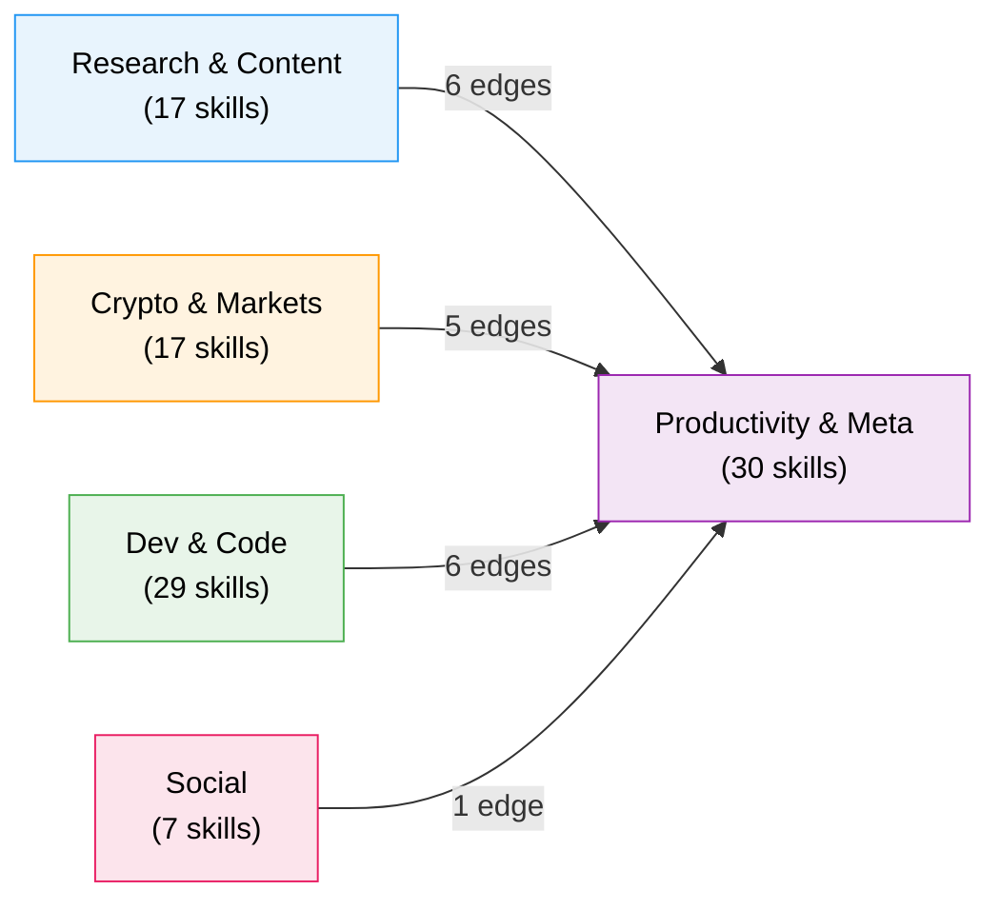
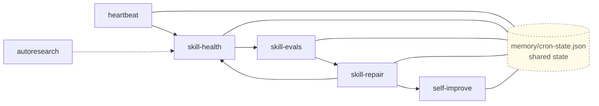
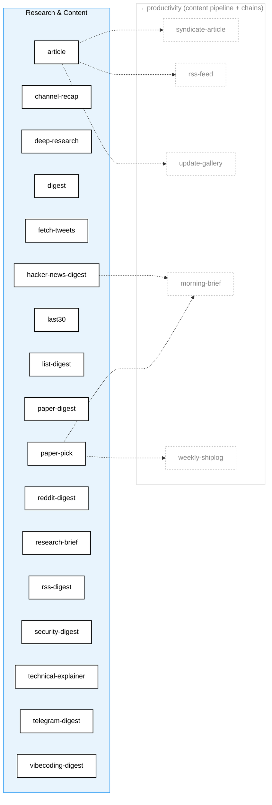
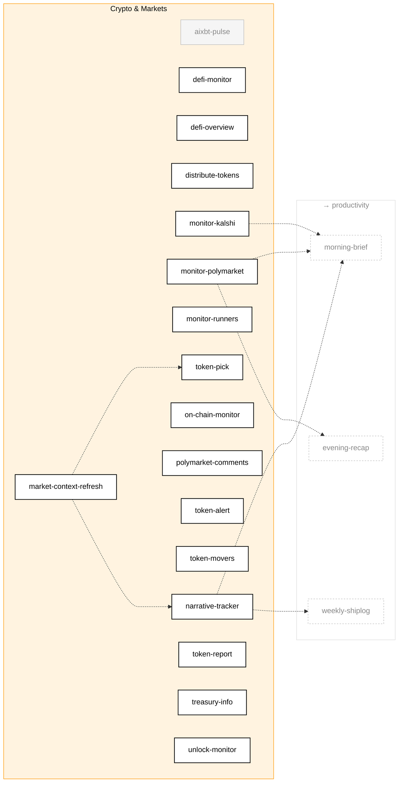
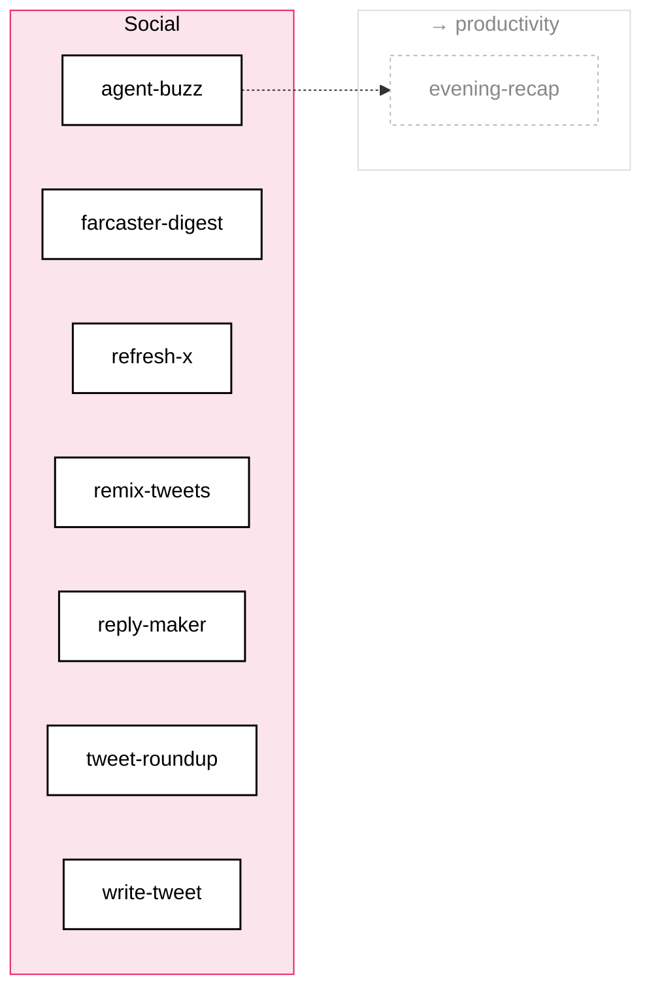

# Skill Dependency Graph

> Auto-generated by `skill-graph` on 2026-04-27. Mode: **SKILL_GRAPH_NEW**. Re-run the skill to update.

**Verdict:** `SKILL_GRAPH_NEW` — initial map of 100 skills across 5 categories. 29 edges total (4 depends_on, 14 consume, 11 shared-state). 97 enabled, 3 disabled.

---

## What changed since last run

First run after introducing change-detection state. No prior state file to diff against — full map regenerated. Future runs will diff added/removed nodes, added/removed edges, and enabled-state flips here.

---

## Overview

Five category boxes with cross-category edge counts. Click into any subgraph below to drill in.

Productivity is the sink: every cross-category edge points into a meta/aggregator skill (`morning-brief`, `evening-recap`, `weekly-shiplog`, `skill-health`, `syndicate-article`, `rss-feed`, `update-gallery`). No reverse flows.

---

## Self-Healing Loop

The most important dependency chain in Aeon. Five skills form a closed loop that detects, diagnoses, and fixes problems without human intervention. All five are in `productivity` and share `memory/cron-state.json`.

`heartbeat` runs 3x daily — the only enabled-by-default tripwire. The reactive trigger that fires `skill-repair` on `consecutive_failures >= 3` is currently commented out in `aeon.yml`; the loop runs on cron alone.

---

## Research & Content (17)

All 17 enabled. No intra-category edges — research skills run independently. Outbound: `paper-pick` and `hacker-news-digest` feed `morning-brief` (chain consume); `article` flows through the content pipeline (`syndicate-article` → Dev.to/Farcaster, `rss-feed` → Atom XML, `update-gallery` → GitHub Pages).

---

## Dev & Code (29)

```mermaid
flowchart LR
    subgraph dev ["Dev & Code"]
        auto-merge
        auto-workflow
        autoresearch
        changelog
        code-health
        create-skill
        deploy-prototype
        external-feature
        fleet-control
        fork-fleet
        github-issues
        github-monitor
        github-releases
        github-trending
        issue-triage
        pr-review
        project-lens
        push-recap
        repo-actions
        repo-article
        repo-pulse
        repo-scanner
        search-skill
        skill-security-scan
        spawn-instance
        star-milestone
        vercel-projects
        vuln-scanner
        workflow-security-audit
    end

    subgraph dOut ["→ productivity"]
        ext_morning_brief2["morning-brief"]:::external
        ext_evening_recap["evening-recap"]:::external
        ext_weekly_shiplog2["weekly-shiplog"]:::external
        ext_skill_health["skill-health"]:::external
    end

    external-feature --> repo-scanner
    vuln-scanner --> github-trending
    repo-scanner -..-> repo-actions

    github-monitor -.-> ext_morning_brief2
    push-recap -.-> ext_evening_recap
    code-health -.-> ext_evening_recap
    repo-pulse -.-> ext_weekly_shiplog2
    push-recap -.-> ext_weekly_shiplog2
    autoresearch -..-> ext_skill_health

    click auto-merge "../skills/auto-merge/SKILL.md"
    click auto-workflow "../skills/auto-workflow/SKILL.md"
    click autoresearch "../skills/autoresearch/SKILL.md"
    click changelog "../skills/changelog/SKILL.md"
    click code-health "../skills/code-health/SKILL.md"
    click create-skill "../skills/create-skill/SKILL.md"
    click deploy-prototype "../skills/deploy-prototype/SKILL.md"
    click external-feature "../skills/external-feature/SKILL.md"
    click fleet-control "../skills/fleet-control/SKILL.md"
    click fork-fleet "../skills/fork-fleet/SKILL.md"
    click github-issues "../skills/github-issues/SKILL.md"
    click github-monitor "../skills/github-monitor/SKILL.md"
    click github-releases "../skills/github-releases/SKILL.md"
    click github-trending "../skills/github-trending/SKILL.md"
    click issue-triage "../skills/issue-triage/SKILL.md"
    click pr-review "../skills/pr-review/SKILL.md"
    click project-lens "../skills/project-lens/SKILL.md"
    click push-recap "../skills/push-recap/SKILL.md"
    click repo-actions "../skills/repo-actions/SKILL.md"
    click repo-article "../skills/repo-article/SKILL.md"
    click repo-pulse "../skills/repo-pulse/SKILL.md"
    click repo-scanner "../skills/repo-scanner/SKILL.md"
    click search-skill "../skills/search-skill/SKILL.md"
    click skill-security-scan "../skills/skill-security-scan/SKILL.md"
    click spawn-instance "../skills/spawn-instance/SKILL.md"
    click star-milestone "../skills/star-milestone/SKILL.md"
    click vercel-projects "../skills/vercel-projects/SKILL.md"
    click vuln-scanner "../skills/vuln-scanner/SKILL.md"
    click workflow-security-audit "../skills/workflow-security-audit/SKILL.md"

    classDef enabled fill:#fff,stroke:#000,stroke-width:1.5px,color:#000
    classDef external fill:none,stroke:#bbb,stroke-dasharray:3 3,color:#888
    class auto-merge,auto-workflow,autoresearch,changelog,code-health,create-skill,deploy-prototype,external-feature,fleet-control,fork-fleet,github-issues,github-monitor,github-releases,github-trending,issue-triage,pr-review,project-lens,push-recap,repo-actions,repo-article,repo-pulse,repo-scanner,search-skill,skill-security-scan,spawn-instance,star-milestone,vercel-projects,vuln-scanner,workflow-security-audit enabled
    style dev fill:#e8f5e9,stroke:#4CAF50,color:#000
    style dOut fill:none,stroke:#ddd,color:#888
```

All 29 enabled. Three intra-category edges: `external-feature` depends on `repo-scanner` (needs repo inventory), `vuln-scanner` depends on `github-trending` (audits trending repos), and `repo-scanner` writes `memory/topics/repos.md` consumed by `repo-actions`. Six outbound edges feed productivity aggregators.

---

## Crypto & Markets (17)

16 enabled, 1 disabled (`aixbt-pulse` — present on disk, not wired into `aeon.yml`). Two intra-category shared-state edges: `market-context-refresh` writes `memory/topics/market-context.md` consumed by `token-pick` and `narrative-tracker`. Heaviest outbound load on `morning-brief` (3 inputs from this category — Polymarket + Kalshi + narratives).

---

## Social (7)

All 7 enabled. No intra-category edges. Single outbound: `agent-buzz` → `evening-recap` chain.

---

## Productivity & Meta (30)

```mermaid
flowchart LR
    subgraph productivity ["Productivity & Meta"]
        action-converter
        cost-report
        create-campaign
        daily-routine
        deal-flow
        evening-recap
        fork-contributor-leaderboard
        fork-skill-digest
        goal-tracker
        heartbeat
        idea-capture
        morning-brief
        onboard
        reflect
        reg-monitor
        rss-feed
        schedule-ads
        self-improve
        skill-evals
        skill-graph
        skill-health
        skill-leaderboard
        skill-repair
        skill-update-check
        startup-idea
        syndicate-article
        tool-builder
        update-gallery
        weekly-review
        weekly-shiplog
    end

    skill-repair --> skill-health
    tool-builder --> action-converter
    heartbeat -..-> skill-health
    skill-health -..-> skill-evals
    skill-evals -..-> skill-repair
    skill-repair -..-> self-improve

    click action-converter "../skills/action-converter/SKILL.md"
    click cost-report "../skills/cost-report/SKILL.md"
    click create-campaign "../skills/create-campaign/SKILL.md"
    click daily-routine "../skills/daily-routine/SKILL.md"
    click deal-flow "../skills/deal-flow/SKILL.md"
    click evening-recap "../skills/evening-recap/SKILL.md"
    click fork-contributor-leaderboard "../skills/fork-contributor-leaderboard/SKILL.md"
    click fork-skill-digest "../skills/fork-skill-digest/SKILL.md"
    click goal-tracker "../skills/goal-tracker/SKILL.md"
    click heartbeat "../skills/heartbeat/SKILL.md"
    click idea-capture "../skills/idea-capture/SKILL.md"
    click morning-brief "../skills/morning-brief/SKILL.md"
    click onboard "../skills/onboard/SKILL.md"
    click reflect "../skills/reflect/SKILL.md"
    click reg-monitor "../skills/reg-monitor/SKILL.md"
    click rss-feed "../skills/rss-feed/SKILL.md"
    click schedule-ads "../skills/schedule-ads/SKILL.md"
    click self-improve "../skills/self-improve/SKILL.md"
    click skill-evals "../skills/skill-evals/SKILL.md"
    click skill-graph "../skills/skill-graph/SKILL.md"
    click skill-health "../skills/skill-health/SKILL.md"
    click skill-leaderboard "../skills/skill-leaderboard/SKILL.md"
    click skill-repair "../skills/skill-repair/SKILL.md"
    click skill-update-check "../skills/skill-update-check/SKILL.md"
    click startup-idea "../skills/startup-idea/SKILL.md"
    click syndicate-article "../skills/syndicate-article/SKILL.md"
    click tool-builder "../skills/tool-builder/SKILL.md"
    click update-gallery "../skills/update-gallery/SKILL.md"
    click weekly-review "../skills/weekly-review/SKILL.md"
    click weekly-shiplog "../skills/weekly-shiplog/SKILL.md"

    classDef enabled fill:#fff,stroke:#000,stroke-width:1.5px,color:#000
    classDef disabled fill:#f5f5f5,stroke:#bbb,color:#888
    class action-converter,cost-report,daily-routine,deal-flow,evening-recap,fork-contributor-leaderboard,fork-skill-digest,goal-tracker,heartbeat,idea-capture,morning-brief,onboard,reflect,reg-monitor,rss-feed,self-improve,skill-evals,skill-graph,skill-health,skill-leaderboard,skill-repair,skill-update-check,startup-idea,syndicate-article,tool-builder,update-gallery,weekly-review,weekly-shiplog enabled
    class create-campaign,schedule-ads disabled
    style productivity fill:#f3e5f5,stroke:#9C27B0,color:#000
```

28 enabled, 2 disabled (`create-campaign`, `schedule-ads` — Meta/TikTok ad-management skills, on disk but not wired into `aeon.yml`). Densest intra-category cluster: the self-healing loop (4 edges) plus 2 `depends_on` edges (`skill-repair`→`skill-health`, `tool-builder`→`action-converter`).

---

## Legend

| Edge | Meaning |
|------|---------|
| `-->` solid | `depends_on` — declared in skill frontmatter; A requires B to run first |
| `-.->` dashed | `consume` — chain step receives output from prior step (`aeon.yml` `chains:`) |
| `-..->` dotted | shared-state via `memory/topics/*` or `memory/state/*`; reactive trigger if active |

| Node style | Meaning |
|-----------|--------|
| Solid black border | `enabled: true` in `aeon.yml` |
| Faded grey | `enabled: false` or absent from `aeon.yml` (skill exists on disk, not wired in) |
| Dashed grey ghost | Cross-category target rendered for context — declared in its own category subgraph |

**Click-through:** every node is a hyperlink to its `SKILL.md` on github.com.

**Collapsed in legend, not in graph:** every skill writes `memory/cron-state.json` after each run. Rendering that as N edges into `heartbeat` / `skill-health` / `skill-repair` would obscure the structural map. The self-healing loop callout above shows the shared-state node explicitly.

---

## Summary

| Metric | Count |
|--------|-------|
| Total skills | 100 |
| Enabled | 97 |
| Disabled | 3 (`aixbt-pulse`, `create-campaign`, `schedule-ads`) |
| Categories | 5 |
| `depends_on` edges | 4 |
| `consume` edges (chains) | 14 |
| Reactive trigger edges | 0 (commented in `aeon.yml`) |
| Shared-state edges | 11 (incl. self-healing loop) |
| Total edges rendered | 29 |
| Independent skills (no edges) | ~76 |

By category:

| Category | Total | Enabled | Disabled |
|----------|-------|---------|----------|
| Research & Content | 17 | 17 | 0 |
| Dev & Code | 29 | 29 | 0 |
| Crypto & Markets | 17 | 16 | 1 |
| Social | 7 | 7 | 0 |
| Productivity & Meta | 30 | 28 | 2 |

Edges by type:

| Type | Count |
|------|-------|
| `depends_on` | 4 |
| `consume` (chain) | 14 |
| Shared-state / pipeline | 11 |
| Reactive | 0 |

---

## Architectural patterns

**Self-healing loop.** `heartbeat` (3x daily) → `skill-health` (daily) → `skill-evals` (Sunday) → `skill-repair` (reactive, currently cron-only) → `self-improve` (every other day). All five share `memory/cron-state.json` and `memory/skill-health/{skill}.json`. This is the only enabled-by-default tripwire chain in the system.

**Hub aggregators.** Three productivity skills consume the highest fan-in:

| Hub | Inputs (count) |
|-----|----------------|
| `morning-brief` | 6 (paper-pick, hacker-news-digest, monitor-polymarket, monitor-kalshi, github-monitor, narrative-tracker) |
| `evening-recap` | 4 (push-recap, monitor-polymarket, agent-buzz, code-health) |
| `weekly-shiplog` | 4 (paper-pick, repo-pulse, push-recap, narrative-tracker) |

`monitor-polymarket`, `paper-pick`, `narrative-tracker`, and `push-recap` each feed two hubs — the highest-leverage upstream skills.

**Content pipeline.** `article` writes to `articles/*.md`; downstream `syndicate-article` cross-posts to Dev.to and Farcaster, `rss-feed` regenerates the Atom XML at `articles/feed.xml`, and `update-gallery` syncs the GitHub Pages site. Other content-tagged skills (`repo-article`, `project-lens`, `technical-explainer`, `channel-recap`, `weekly-shiplog`) feed the same pipeline by writing into `articles/`.

**Decoupled by default.** Roughly three-quarters of skills have no edges at all — they read `memory/MEMORY.md` and emit a notification. Failures stay local. The clusters above are the load-bearing structure.

---

## Source-status footer

`skills parsed: 100 · depends_on: 4 · consume: 14 · reactive: 0 · shared-state derived: 11 · enabled: 97/100 · mode: SKILL_GRAPH_NEW`
